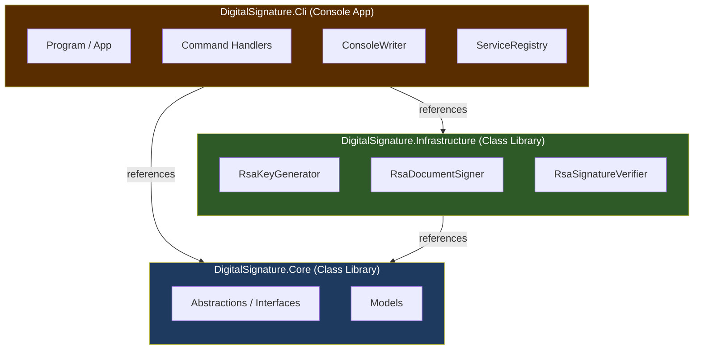
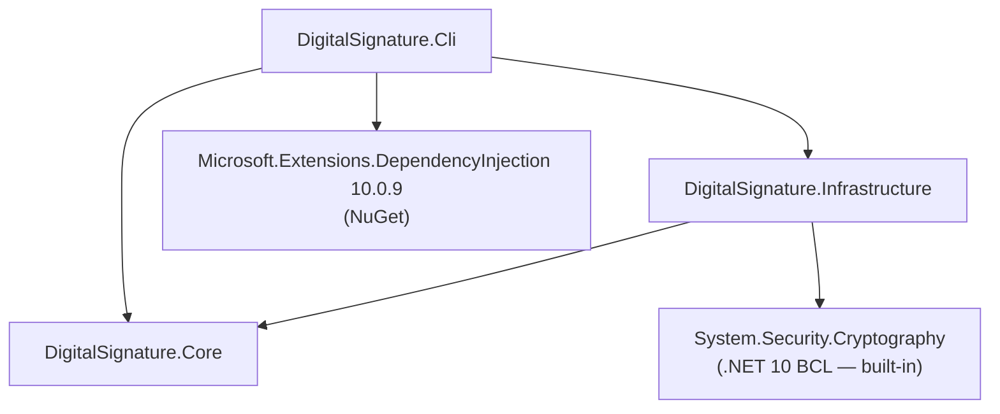
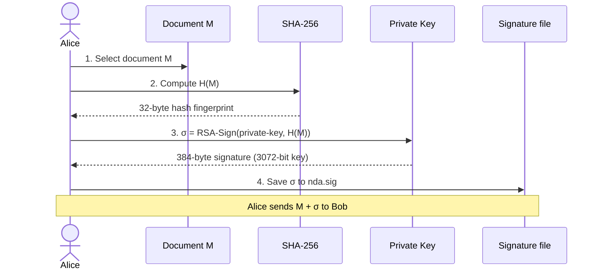
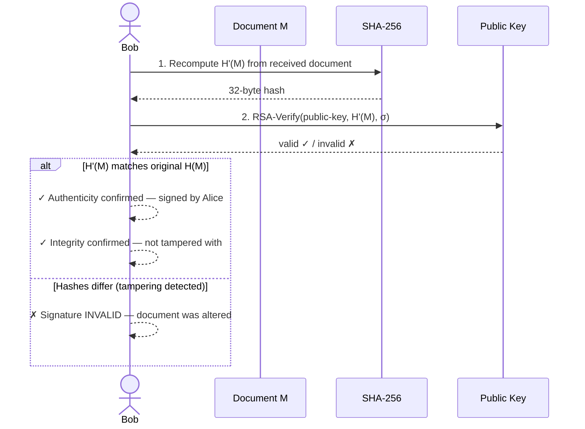
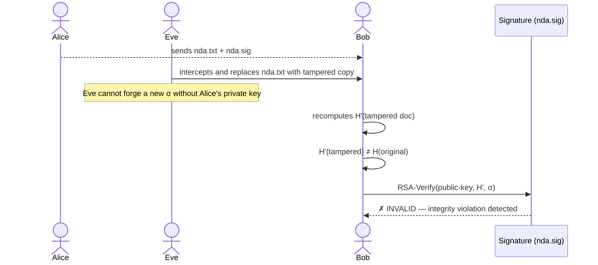
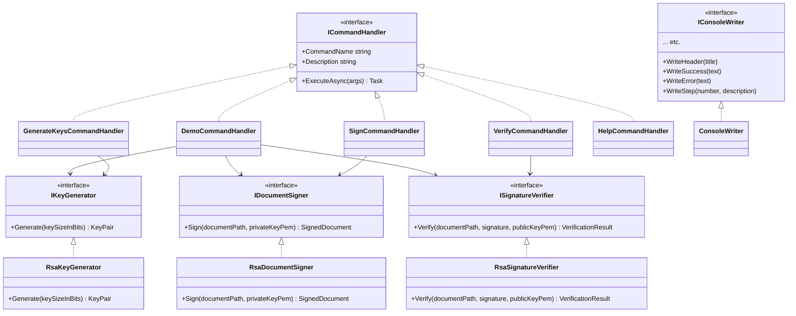

# Digital Signature — Authenticity & Integrity in Practice

A .NET 10 / C# 14 CLI application that simulates the cryptographic signing workflow described in my article
**"Electronic Signatures: Authenticity & Integrity in Practice"** [1].

> **Key insight:** Digital signatures are *not* encryption.
> Encryption → Confidentiality | Signatures → Authenticity + Integrity

---

## Architecture

The solution follows a three-layer architecture based on the **Dependency Inversion Principle** (DIP): the inner layers define abstractions; outer layers implement them. In this example, Core holds the abstraction (Interfaces) and Models. Core defines what a signer is (IDocumentSigner). Infrastructure defines how it is done (RsaDocumentSigner). Cli defines what uses it (DemoCommandHandler, SignCommandHandler). The arrow of dependency always points inward - never outward:


In a traditional layered architecture, the UI depends on the service layer, which depends on the data layer — dependencies flow downward toward the infrastructure. DIP inverts this: the infrastructure depends on abstract contracts defined by the business core, so the core is shielded from all implementation details.

### SOLID responsibilities

| Layer | Responsibility |
|---|---|
| **Core** | Domain models (`KeyPair`, `SignedDocument`, `VerificationResult`) and interfaces. Zero external dependencies. |
| **Infrastructure** | RSA + SHA-256 implementations using `System.Security.Cryptography`. Only knows about Core. |
| **Cli** | DI wiring, command routing, console presentation. Depends on abstractions, not concretions. |

---

## Package & Project Dependencies



No third-party crypto libraries are used. All cryptographic operations rely on the built-in `System.Security.Cryptography` namespace that ships with .NET.

---

## Digital Signature Workflow

### Signing (sender side)
Alice - as sender - selects the document and calculates a hash value from it, using the cryptographic hash function H. She uses the private key and a signature algorithm to sign this hash, producing a signature σ. Finally she sends the document and σ to Bob.
Note:  The document is never encrypted at any point.



### Verification (recipient side)
Bob - as recipient - recomputes the hash H(M) from the document and verifies σ using the Alice’s public key. If verification succeeds, the message (with the document) is accepted as authentic and unmodified (integer)



### Attack simulation (Eve tampers with the document)



---

## Class Structure



---

## Project Structure

```
digitalsignature.sln
└─ src/
   ├─ DigitalSignature.Core/
   │   ├─ Abstractions/
   │   │   ├─ ICommandHandler.cs
   │   │   ├─ IConsoleWriter.cs
   │   │   ├─ IDocumentSigner.cs
   │   │   ├─ IKeyGenerator.cs
   │   │   └─ ISignatureVerifier.cs
   │   └─ Models/
   │       ├─ KeyPair.cs
   │       ├─ SignedDocument.cs
   │       └─ VerificationResult.cs
   ├─ DigitalSignature.Infrastructure/
   │   └─ Cryptography/
   │       ├─ RsaDocumentSigner.cs
   │       ├─ RsaKeyGenerator.cs
   │       └─ RsaSignatureVerifier.cs
   └─ DigitalSignature.Cli/
       ├─ Commands/
       │   ├─ DemoCommandHandler.cs
       │   ├─ GenerateKeysCommandHandler.cs
       │   ├─ HelpCommandHandler.cs
       │   ├─ SignCommandHandler.cs
       │   └─ VerifyCommandHandler.cs
       ├─ DependencyInjection/
       │   └─ ServiceRegistry.cs
       ├─ Presentation/
       │   └─ ConsoleWriter.cs
       ├─ App.cs
       └─ Program.cs
```

---

## Libraries & Technologies

| Library / Technology | Version | Purpose |
|---|---|---|
| **.NET** | 10.0 | Runtime and BCL |
| **C#** | 14 (preview) | Language — uses `field` keyword, primary constructors, collection expressions |
| **System.Security.Cryptography** | .NET BCL (built-in) | RSA key generation, SHA-256 hashing, PKCS#1 signing and verification |
| **Microsoft.Extensions.DependencyInjection** | 10.0.9 | Constructor injection — decouples commands from crypto implementations |

### C# 14 features used

| Feature | Where |
|---|---|
| `field` keyword (semi-auto property) | `ConsoleWriter.IndentLevel` — guarded setter without an explicit backing field |
| Primary constructors | All command handlers and service classes |
| Collection expressions `[]` | Argument slicing in `App.RunAsync` |
| `LangVersion preview` | All three `.csproj` files |

---

## Commands

```
digitalsignature demo                                    — guided end-to-end walkthrough
digitalsignature generate [<dir>] [--bits <n>]          — generate RSA key pair
digitalsignature sign <file> [<private-key.pem>]        — sign a document
digitalsignature verify <file> <sig> [<public-key.pem>] — verify a signature
digitalsignature help                                    — list all commands
```

## How to run

```powershell
# From the solution root:
dotnet run --project src/DigitalSignature.Cli -- demo
dotnet run --project src/DigitalSignature.Cli -- help

# Or publish a self-contained executable:
dotnet publish src/DigitalSignature.Cli -c Release -r win-x64 --self-contained -o ./publish
.\publish\DigitalSignature.Cli.exe demo
```

---

## Background: signatures vs. encryption

| Property | Encryption | Digital Signature |
|---|---|---|
| Goal | Confidentiality | Authenticity + Integrity |
| Key used to protect | Recipient's **public** key | Sender's **private** key |
| Key used to open/verify | Recipient's **private** key | Sender's **public** key |
| Prevents eavesdropping | Yes | No |
| Proves origin | No | Yes |
| Detects tampering | No | Yes |

The EU's **eIDAS** regulation builds on this cryptographic core to define legally binding qualified electronic signatures.

# References
https://www.linkedin.com/pulse/electronic-signatures-authenticity-integrity-practice-dirk-ljgrf/?trackingId=i0iZtPpHTu6DpmuKgfxLGQ%3D%3D
